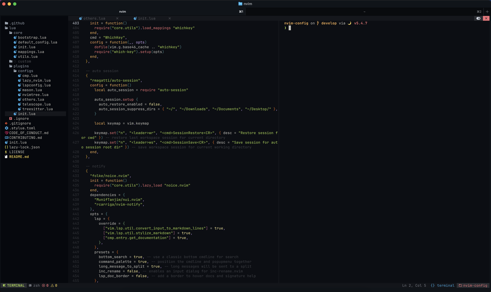

<p align="center">
  
</p>

# NVIM Config

This repository contains personalized configurations for nvim using Lua and NvChad ⚙️🪴

## Configure NVIM Config

Go to the repo directory and use symlink for nvim config

```sh
ln -s . ~/.config/nvim
```

## Setup Neovim

### Setup Requires

- True Color Terminal Like: [iTerm2](https://iterm2.com/), [Ghostty](https://ghostty.org), [KiTTY](https://9bis.net/kitty)
- [Neovim](https://neovim.io/) (Version 0.9 or Later)
- [Nerd Font](https://www.nerdfonts.com/) - I use Meslo Nerd Font
- [Ripgrep](https://github.com/BurntSushi/ripgrep) - For Telescope Fuzzy Finder
- XCode Command Line Tools

Install Deps with Homebrew:

```sh
brew install node vim neovim tree-sitter git fd ripgrep lazygit lua luajit
```

### Install the config

Make sure to remove or move your current nvim directory

```sh
git clone https://github.com/andostronaut/nvim-config.git ~/.config/nvim

```

Run nvim and wait for the plugins to be installed

### Use Lazy vim

```
:Lazy
```

and to sync

```
:Lazy sync
```

### Get healthy

Open nvim and enter the following:

```
:checkhealth
```

### Install Mason LSP and Plugins

[Mason](https://github.com/williamboman/mason.nvim) is a package manager for Neovim that helps manage LSP servers, DAP servers, linters, and formatters.

To install and set up Mason:

1. Open Neovim and run:

   ```
   :Mason
   ```

   This will open Mason's interface where you can browse and install packages.

2. Install preconfigured tools by running:

   ```
   :MasonToolsInstall
   ```

The above will install commonly used development tools like:

- Language servers (LSP)
- Linters
- Formatters

For troubleshooting, check Mason's logs with `:MasonLog`.

### Setup Go on Neovim

Install binaries on running this command `GoInstallBinaries`

## Uninstall nvim

```sh
# Linux / Macos (unix)
rm -rf ~/.config/nvim
rm -rf ~/.local/share/nvim

# Windows
rd -r ~\AppData\Local\nvim
rd -r ~\AppData\Local\nvim-data
```

## License

[MIT](LICENSE)
